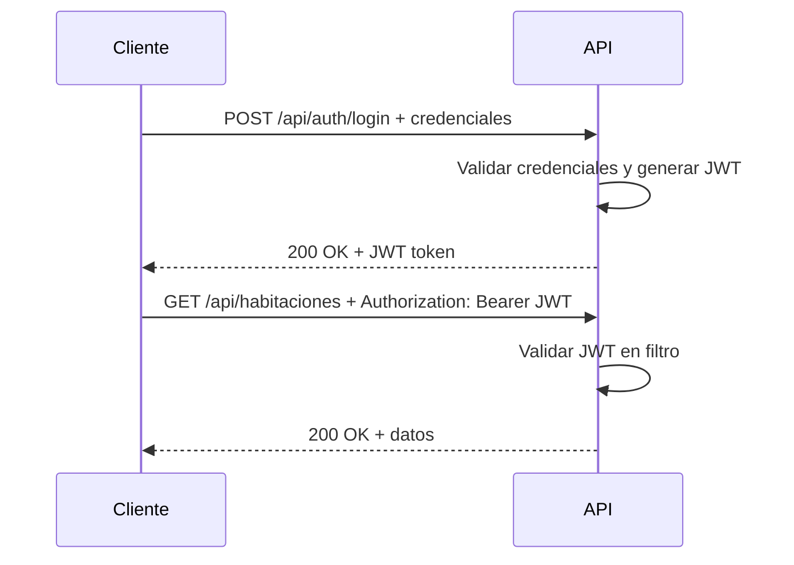

# Hotel Cervera API


API REST para la gestión integral del **Hotel Cervera Rio Santiago**. Autenticación JWT, documentación OpenAPI 3.1 interactiva y cobertura completa de operaciones hoteleras.

## 🚀 Inicio

**Prerrequisitos:** Java 17 y Maven (incluido como wrapper).

```bash
# 1. Clona el repositorio
git clone https://github.com/tu-usuario/sistema-gestion-hotel-cervera.git
cd sistema-gestion-hotel-cervera/api-rest/hotel_cervera_api

# 2. Configura variables de entorno
cp .env.example .env
# Edita .env con tus valores (ver sección Configuración)

# 3. Ejecuta la aplicación
./mvnw spring-boot:run
```

La API estará disponible en **http://localhost:8080**.
Abre [Swagger UI](http://localhost:8080/swagger-ui.html) para probar los endpoints.

### Credenciales por Defecto

| Usuario | Rol | Contraseña |
|:---|---:|---:|
| `gerente` | Gerente | `Admin123` |

## ✨ Características

- **Autenticación JWT** — Login seguro con tokens, protección de rutas por rol (gerente, limpieza)
- **Gestión de Clientes** — CRUD completo con búsqueda por tipo/número de documento
- **Gestión de Habitaciones** — CRUD, filtros por piso/estado, consulta de disponibilidad por fechas
- **Reservas** — Creación con múltiples habitaciones, cancelación con motivo, gestión de detalles
- **Check-in / Check-out** — Registro de estadías, control de ocupación
- **Pagos** — Registro de pagos con comprobante, IGV, métodos de pago
- **Gastos Operativos** — Registro, filtros por período/categoría, resumen agregado
- **Limpieza** — Asignación y control de tareas de limpieza por habitación
- **Reportes** — Ocupación diaria, ingresos, ganancias netas, proyección de ocupación
- **Historial de Precios** — Precios por tipo de habitación con vigencia en el tiempo
- **Roles y Usuarios** — Administración de usuarios con roles y cambio de contraseña
- **Documentación OpenAPI** — Swagger UI interactivo con botón Authorize para JWT

## ⚙️ Configuración

La aplicación se configura mediante variables de entorno (archivo `.env`):

| Variable | Descripción | Valor por Defecto | Requerida |
|:---|---:|---:|---:|
| `DB_HOST` | Host de PostgreSQL | `localhost` | Sí |
| `DB_PORT` | Puerto de PostgreSQL | `5432` | Sí |
| `DB_NAME` | Nombre de la base de datos | `hotel_cervera_db` | Sí |
| `DB_USER` | Usuario de base de datos | `postgres` | Sí |
| `DB_PASSWORD` | Contraseña de base de datos | — | Sí |
| `JWT_SECRET` | Clave secreta para firmar tokens JWT | — | Sí |
| `JWT_EXPIRATION` | Tiempo de expiración del token (ms) | `86400000` (1 día) | No |
| `SERVER_PORT` | Puerto del servidor | `8080` | No |

## 🔐 Flujo de Autenticación



Todos los endpoints (excepto `/api/auth/**`) requieren el header:
```
Authorization: Bearer <token>
```

Usa el botón **Authorize** en Swagger UI para probar los endpoints autenticados.

## 📚 Documentación de la API

| Recurso | URL |
|:---|---:|
| Swagger UI (interactivo) | `http://localhost:8080/swagger-ui.html` |
| Especificación OpenAPI (JSON) | `http://localhost:8080/v3/api-docs` |
| Actuator | `http://localhost:8080/actuator` |

Puedes importar `http://localhost:8080/v3/api-docs` directamente a Postman.

## 🏗️ Construido Con

| Tecnología | Propósito |
|:---|---:|
| Java 17 | Lenguaje base |
| Spring Boot 4.0.6 | Framework de aplicación |
| Spring Security | Autenticación y autorización |
| JSON Web Tokens (jjwt 0.12.3) | Tokens de acceso |
| PostgreSQL 16 | Base de datos relacional |
| Spring Data JPA | Capa de persistencia |
| Springdoc OpenAPI 2.5.0 | Documentación OpenAPI 3.1 |
| Lombok | Reducción de boilerplate |
| Maven | Gestión de dependencias y build |

## 📄 Licencia

Copyright (c) 2026 Hotel Cervera Rio Santiago S.A.